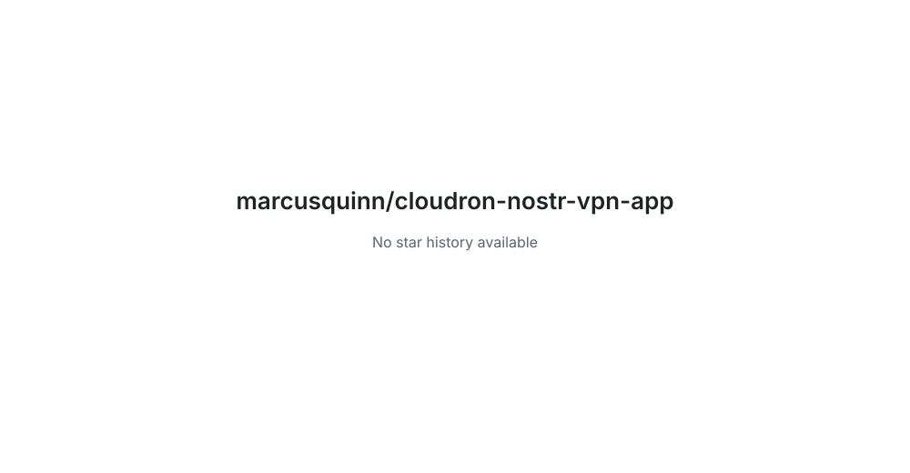

# cloudron-nostr-vpn-app

<!-- aidevops:badges:start -->
<!-- managed by aidevops badges; edit the template, not this block -->
<!-- Build & Quality Status -->

<!-- License & Legal -->

<!-- Repository Metrics -->

<!-- Project Links -->

<!-- aidevops:badges:end -->
Nostr VPN FIPS transit and bootstrap node - Cloudron app package

<!-- aidevops:managed-readme:start -->
<!-- managed by aidevops; refresh with managed-readme-helper.sh sync -->
## Star History

## Built with aidevops

This project was created and is maintained with
[aidevops.sh](https://aidevops.sh).

[View marcusquinn on GitHub](https://github.com/marcusquinn) ·
[aidevops repository](https://github.com/marcusquinn/aidevops)
<!-- aidevops:managed-readme:end -->
